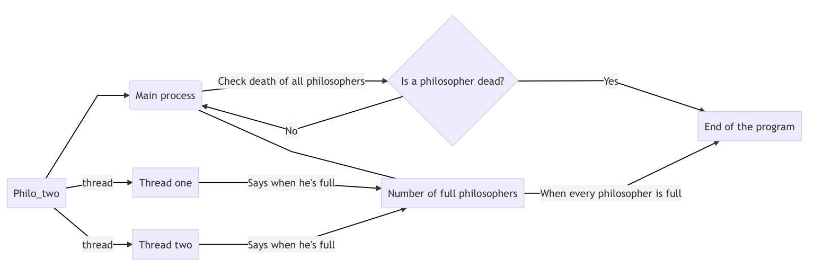

# Philosophers

Vous trouverez ci-dessous une description du projet Philosophers avec des explications et justifications des choix effectués.

## SUMMARY

[Introduction](#introduction)  
* [Philo_one - Spécificités](#philo_one---spécificités)  
* [Philo_two - Spécificités](#philo_two---spécificités)  
* [Philo_three - Spécificités](#philo_three---spécificités)  

[Philo_one](#philo_one)  
* [Structure globale](#1-structure-globale)  
* [Gestion des mutex](#1-gestion-des-mutex)  
* [Vérification de la mort des philosophes](#1-vérification-de-la-mort-des-philosophes)  
* [Spécificités](#1-spécificités)

[Philo_two](#philo_two)  
* [Structure globale](#2-structure-globale)  
* [Gestion des semaphores](#2-gestion-des-semaphores)  
* [Vérification de la mort des philosophes](#2-vérification-de-la-mort-des-philosophes)  
* [Spécificités](#2-spécificités)

[Philo_three](#philo_three)  
* [Structure globale](#3-structure-globale)  
* [Gestion des semaphores et forks](#3-gestion-des-semaphores-et-forks)  
* [Vérification de la mort des philosophes](#3-vérification-de-la-mort-des-philosophes)  
* [Spécificités](#3-spécificités)

## Introduction

Le sujet du projet est disponible dans le repository git, nous rappelerons seulement ici les spécificités des 3 parties (philo_one, philo_two et philo_three) du projet.

Nous identifierons respectivement les fourchettes et philosophes numéro i par les appellations fork_i et philo_i.

Sur les schémas ci-dessous, un philosophe rassasié est dit "full".

#### Philo_one - Spécificités

- Utilisation de mutex
- Les fourchettes sont situées entre les philosophes (fork_n disponible pour philo_n et philo_n+1)
- Chaque philosophe est géré par un thread

#### Philo_two - Spécificités

- Utilisation de semaphores
- Les fourchettes sont situées au centre de la table (fork_n disponible pour tous les philosophes)
- Chaque philosophe est géré par un thread

#### Philo_three - Spécificités

- Utilisation de semaphores
- Les fourchettes sont situées au centre de la table (fork_n disponible pour tous les philosophes)
- Chaque philosophe est géré par un fork (child process)

###### &nbsp; &nbsp; &nbsp; &nbsp; &nbsp; &nbsp; &nbsp; &nbsp; &nbsp; &nbsp; &nbsp; &nbsp; &nbsp; &nbsp; &nbsp; &nbsp; &nbsp; &nbsp; &nbsp; &nbsp; &nbsp; &nbsp; &nbsp; &nbsp; &nbsp; &nbsp; &nbsp; &nbsp; &nbsp; &nbsp; &nbsp; &nbsp; &nbsp; &nbsp; &nbsp; &nbsp; &nbsp; &nbsp; &nbsp; &nbsp; &nbsp; &nbsp; &nbsp; &nbsp; &nbsp; &nbsp; &nbsp; &nbsp; &nbsp; &nbsp; &nbsp; &nbsp; &nbsp; &nbsp; &nbsp; &nbsp; &nbsp; &nbsp; &nbsp; &nbsp; &nbsp; &nbsp; &nbsp; &nbsp; &nbsp; &nbsp; &nbsp; &nbsp; &nbsp; &nbsp; &nbsp; &nbsp; &nbsp; &nbsp; &nbsp; &nbsp; &nbsp; &nbsp; &nbsp; &nbsp; &nbsp; &nbsp; &nbsp; &nbsp; &nbsp; &nbsp; &nbsp; &nbsp; &nbsp; &nbsp; &nbsp; &nbsp; &nbsp; &nbsp; &nbsp; &nbsp; &nbsp; &nbsp; &nbsp; &nbsp; &nbsp; &nbsp; &nbsp; &nbsp; &nbsp; &nbsp; *[to the top](#philosophers)*

## Philo_one

### 1. Structure globale

### 1. Gestion des mutex

Chaque fourchette a son propre mutex qui permet de la verrouiller lorsqu'un philosophe la prend.

On utilise aussi un mutex partagé par tous les philosophes qui permet de print du texte sans mélange.

### 1. Vérification de la mort des philosophes

Le programme "parent" ayant accès aux ressources des threads, c'est lui qui vérifie en permanence en fond si chaque philosophe est encore vivant.

### 1. Spécificités

##### 1. Eviter de se retrouver bloqué

Si chaque philosophe prend en même temps sa fourchette gauche, aucun ne pourra prendre sa fourchette droite.

Pour éviter cette situation :
- Les philosophes pairs (0, 2, 4...) commencent par prendre leur fourchette droite, puis leur fourchette gauche.
- Les philosophes impairs font l'inverse.

##### 2. Eviter la mort d'un philosophe

Selon les paramètres utilisés, une fourchette pourrait être utilisée deux fois d'affilée par le même philosophe.

Pour éviter cette situation :
- Chaque fourchette note le numéro du dernier philosophe l'ayant utilisée.
- Un philosophe n'essaye de prendre une fourchette que s'il n'est pas le dernier à l'avoir utilisée.

###### &nbsp; &nbsp; &nbsp; &nbsp; &nbsp; &nbsp; &nbsp; &nbsp; &nbsp; &nbsp; &nbsp; &nbsp; &nbsp; &nbsp; &nbsp; &nbsp; &nbsp; &nbsp; &nbsp; &nbsp; &nbsp; &nbsp; &nbsp; &nbsp; &nbsp; &nbsp; &nbsp; &nbsp; &nbsp; &nbsp; &nbsp; &nbsp; &nbsp; &nbsp; &nbsp; &nbsp; &nbsp; &nbsp; &nbsp; &nbsp; &nbsp; &nbsp; &nbsp; &nbsp; &nbsp; &nbsp; &nbsp; &nbsp; &nbsp; &nbsp; &nbsp; &nbsp; &nbsp; &nbsp; &nbsp; &nbsp; &nbsp; &nbsp; &nbsp; &nbsp; &nbsp; &nbsp; &nbsp; &nbsp; &nbsp; &nbsp; &nbsp; &nbsp; &nbsp; &nbsp; &nbsp; &nbsp; &nbsp; &nbsp; &nbsp; &nbsp; &nbsp; &nbsp; &nbsp; &nbsp; &nbsp; &nbsp; &nbsp; &nbsp; &nbsp; &nbsp; &nbsp; &nbsp; &nbsp; &nbsp; &nbsp; &nbsp; &nbsp; &nbsp; &nbsp; &nbsp; &nbsp; &nbsp; &nbsp; &nbsp; &nbsp; &nbsp; &nbsp; &nbsp; &nbsp; &nbsp; *[to the top](#philosophers)*

## Philo_two

### 2. 1-Structure globale

La structure globale de Philo_two est la même que celle de Philo_one.

### 2. Gestion des semaphores

On utilise un seul semaphore global pour gérer l'ensemble des fourchettes. Sa valeur initiale est le nombre de philosophes.

On utilise aussi un semaphore partagé par tous les philosophes qui permet de print du texte sans mélange. Sa valeur initiale est égale à un.

### 2. Vérification de la mort des philosophes

Le programme "parent" ayant accès aux ressources des threads, c'est lui qui vérifie en permanence en fond si chaque philosophe est encore vivant.

### 2. Spécificités

##### 1. Eviter la mort d'un philosophe

Si aucune précaution n'est prise, certains philosophes pourraient manger deux fois pendant que d'autres attendent leur tour, provoquant leur mort.

Pour éviter cette situation :
- On utilise un entier croissant représentant le prochain philosophe à être autorisé à prendre une fourchette.
- Quand le philosophe en question a pris ses deux fouchettes, on incrémente l'entier (ou on lui donne la valeur de 1 si on était rendu au dernier philosophe).

###### &nbsp; &nbsp; &nbsp; &nbsp; &nbsp; &nbsp; &nbsp; &nbsp; &nbsp; &nbsp; &nbsp; &nbsp; &nbsp; &nbsp; &nbsp; &nbsp; &nbsp; &nbsp; &nbsp; &nbsp; &nbsp; &nbsp; &nbsp; &nbsp; &nbsp; &nbsp; &nbsp; &nbsp; &nbsp; &nbsp; &nbsp; &nbsp; &nbsp; &nbsp; &nbsp; &nbsp; &nbsp; &nbsp; &nbsp; &nbsp; &nbsp; &nbsp; &nbsp; &nbsp; &nbsp; &nbsp; &nbsp; &nbsp; &nbsp; &nbsp; &nbsp; &nbsp; &nbsp; &nbsp; &nbsp; &nbsp; &nbsp; &nbsp; &nbsp; &nbsp; &nbsp; &nbsp; &nbsp; &nbsp; &nbsp; &nbsp; &nbsp; &nbsp; &nbsp; &nbsp; &nbsp; &nbsp; &nbsp; &nbsp; &nbsp; &nbsp; &nbsp; &nbsp; &nbsp; &nbsp; &nbsp; &nbsp; &nbsp; &nbsp; &nbsp; &nbsp; &nbsp; &nbsp; &nbsp; &nbsp; &nbsp; &nbsp; &nbsp; &nbsp; &nbsp; &nbsp; &nbsp; &nbsp; &nbsp; &nbsp; &nbsp; &nbsp; &nbsp; &nbsp; &nbsp; &nbsp; *[to the top](#philosophers)*

## Philo_three

### 3.Structure globale

### 3.Gestion des semaphores et forks

*Cf même section de Philo_two pour le semaphore des fourchettes et celui de l'écriture.*

Contrairement à Philo_one et Philo_two qui utilisaient des threads, l'utilisation de processus fils ne permet pas :
- Aux childs de modifier une valeur dans le processus parent (pour indiquer qu'un philosophe est mort ou rassasié).
- Au parent de vérifier si le philosophe d'un des childs est mort.

On va utiliser deux semaphores supplémentaires pour ces actions : end_sem et full_sem.

### 3.Vérification de la mort des philosophes

Le programme "parent" n'ayant pas accès aux ressources des childs, ceux-ci doivent vérifier eux-mêmes si leur philosophe est encore vivant.

### 3.Spécificités

##### 1. Indiquer au processus parent qu'un philosophe est rassasié

Après avoir créé tous les processus fils, le processus parent essaye d'utiliser le semaphore sem_end autant de fois qu'il y a de philosophes.

Lorsqu'un philosophe est rassasié, il transmet l'information au processus parent en incrémentant une fois le semaphore sem_end.

Une fois tous les philosophes rassasiés, le processus parent peut continuer, terminer tous les processus fils et quitter.

##### 2. Eviter du retard dans l'annonce de la mort d'un philosophe

L'annonce de la mort d'un philosophe devant être signalée au maximum 10ms après son occurence, il ne faudrait pas qu'elle soit retardée.

Si un philosophe essaye de prendre une fourchette verrouillée, il se met en attente et ne peux pas vérifier son état (mort/vivant) pendant ce temps.

On crée donc un thread dès l'initialisation du child. Ce thread vérifie en permanence en fond si le philosophe de son processus est mort.

Si un philosophe meurt, le processsus concerné transmet l'information au processus parent en incrémentant le semaphore end_sem du nombre de philosophes.

Il verrouille également le semaphore, empêchant l'écriture du message indiquant que tous les philosophes sont rassasiés.

###### &nbsp; &nbsp; &nbsp; &nbsp; &nbsp; &nbsp; &nbsp; &nbsp; &nbsp; &nbsp; &nbsp; &nbsp; &nbsp; &nbsp; &nbsp; &nbsp; &nbsp; &nbsp; &nbsp; &nbsp; &nbsp; &nbsp; &nbsp; &nbsp; &nbsp; &nbsp; &nbsp; &nbsp; &nbsp; &nbsp; &nbsp; &nbsp; &nbsp; &nbsp; &nbsp; &nbsp; &nbsp; &nbsp; &nbsp; &nbsp; &nbsp; &nbsp; &nbsp; &nbsp; &nbsp; &nbsp; &nbsp; &nbsp; &nbsp; &nbsp; &nbsp; &nbsp; &nbsp; &nbsp; &nbsp; &nbsp; &nbsp; &nbsp; &nbsp; &nbsp; &nbsp; &nbsp; &nbsp; &nbsp; &nbsp; &nbsp; &nbsp; &nbsp; &nbsp; &nbsp; &nbsp; &nbsp; &nbsp; &nbsp; &nbsp; &nbsp; &nbsp; &nbsp; &nbsp; &nbsp; &nbsp; &nbsp; &nbsp; &nbsp; &nbsp; &nbsp; &nbsp; &nbsp; &nbsp; &nbsp; &nbsp; &nbsp; &nbsp; &nbsp; &nbsp; &nbsp; &nbsp; &nbsp; &nbsp; &nbsp; &nbsp; &nbsp; &nbsp; &nbsp; &nbsp; &nbsp; *[to the top](#philosophers)*