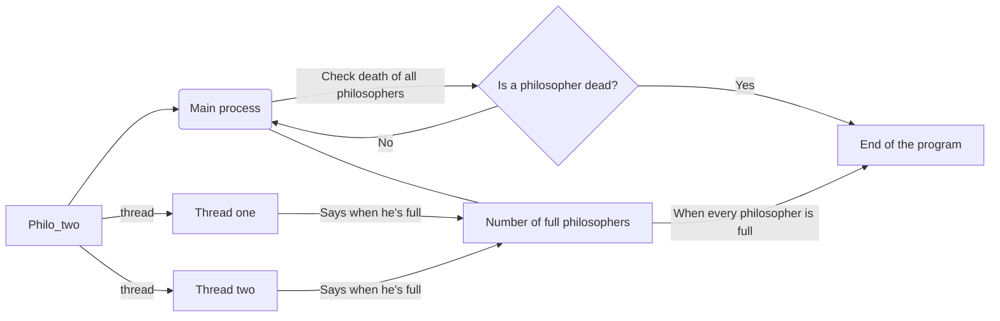
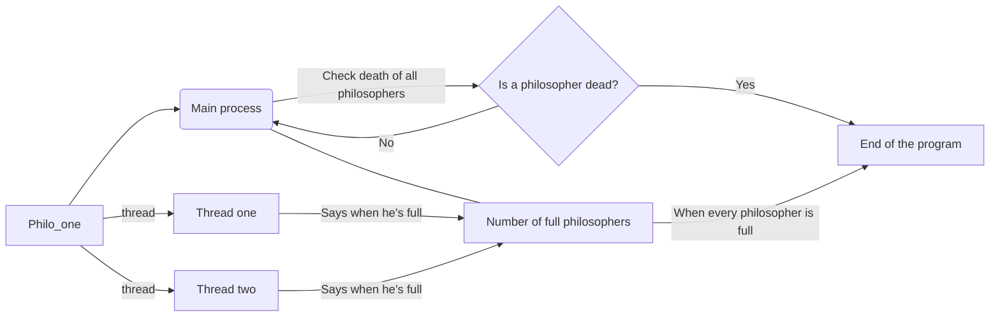
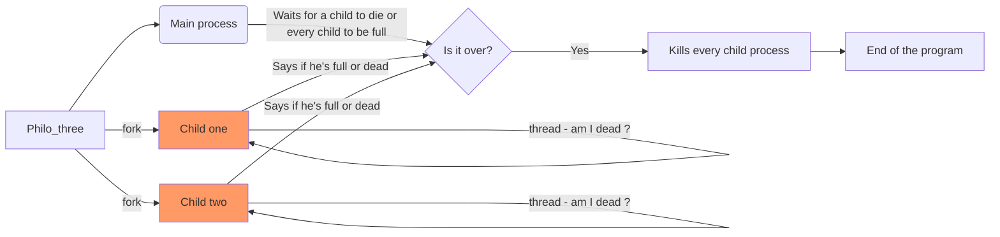

```mermaid
graph LR
A[Philo_two] -->B(Main process)
    A -->|thread| D[Thread one]
    A -->|thread| E[Thread two]
    B --> |Check death of all philosophers| C{Is a philosopher dead?}
		C --> |No| B
		C --> |Yes| F[End of the program]
		B --- G[Number of full philosophers]
		D --> |Says when he's full| G
		E --> |Says when he's full| G
		G --> |When every philosopher is full| F
```

```mermaid
graph LR
A[Philo_one] -->B(Main process)
    A -->|thread| D[Thread one]
    A -->|thread| E[Thread two]
    B --> |Check death of all philosophers| C{Is a philosopher dead?}
		C --> |No| B
		C --> |Yes| F[End of the program]
		B --- G[Number of full philosophers]
		D --> |Says when he's full| G
		E --> |Says when he's full| G
		G --> |When every philosopher is full| F
```

```mermaid
graph LR
classDef child fill:#f96;
A[Philo_three] -->B(Main process)
    A -->|fork| D[Child one]
    A -->|fork| E[Child two]
    B --> |Waits for a child to die or every child to be full| C{Is it over?}
    C --> |Yes| F[Kills every child process]
		F --> H[End of the program]
		D:::child --> |thread - am I dead ?| D
		E:::child --> |thread - am I dead ?| E
		D --> |Says if he's full or dead| C
		E --> |Says if he's full or dead| C
```

